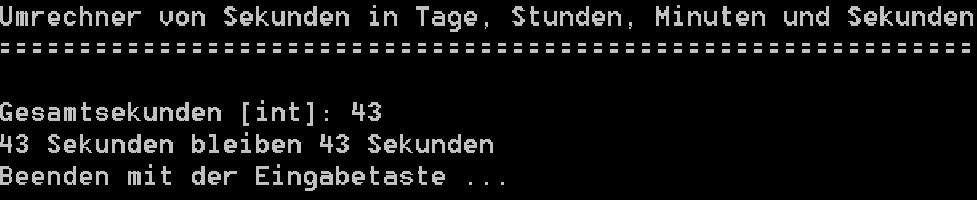

# POSE-TimeCalculator

## Task 

The program implements a time converter that converts entered seconds into
days, hours, minutes and seconds. The higher-order digits are only output if
the value is greater than 0 (e.g. days are only output if the result is at
least one day).
The output must be based on the specifications:

